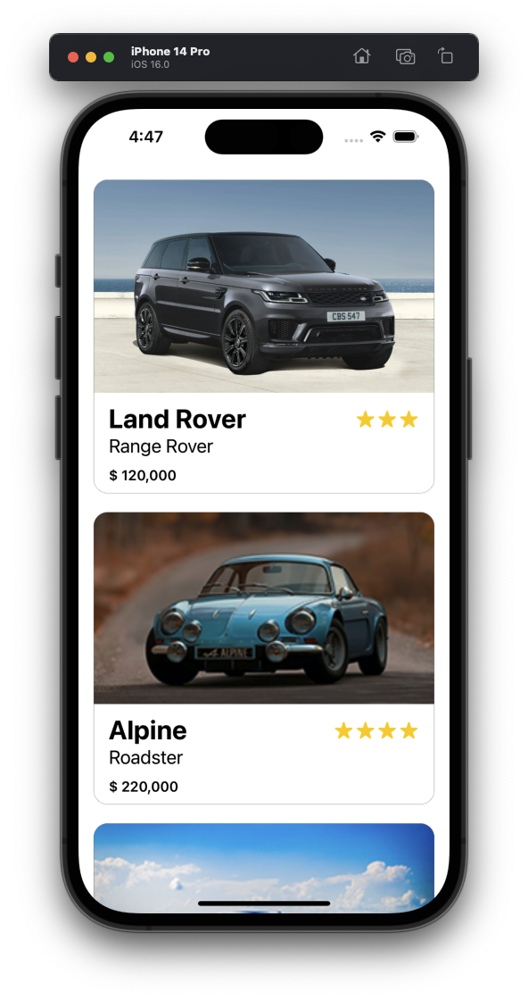
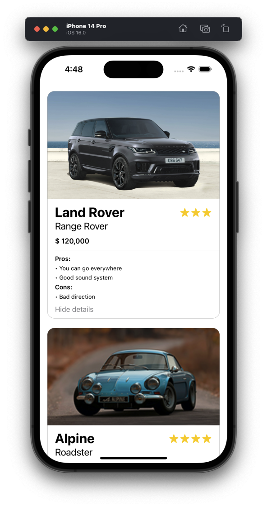
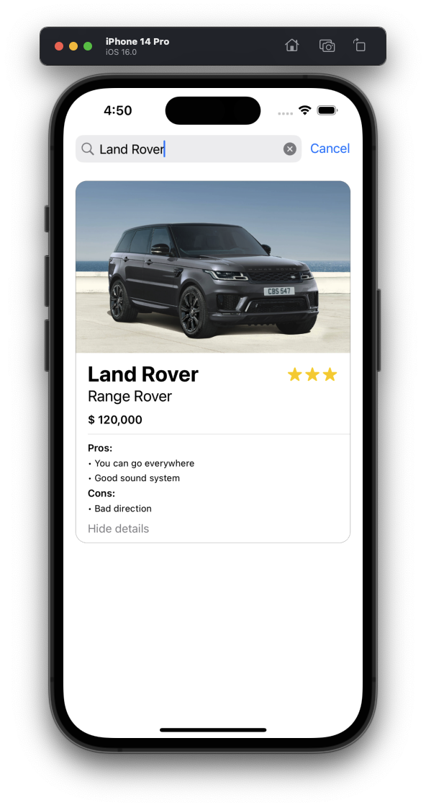
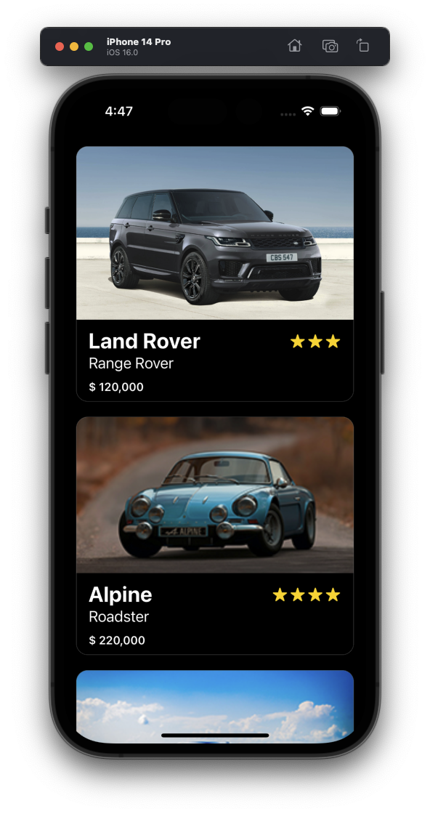
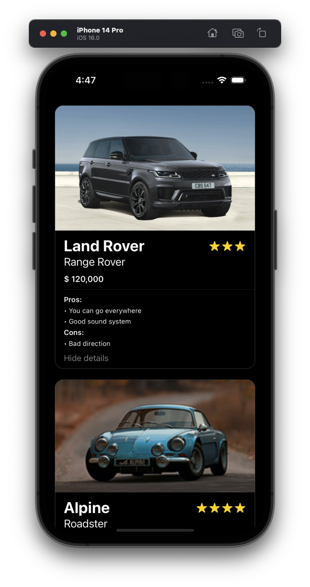
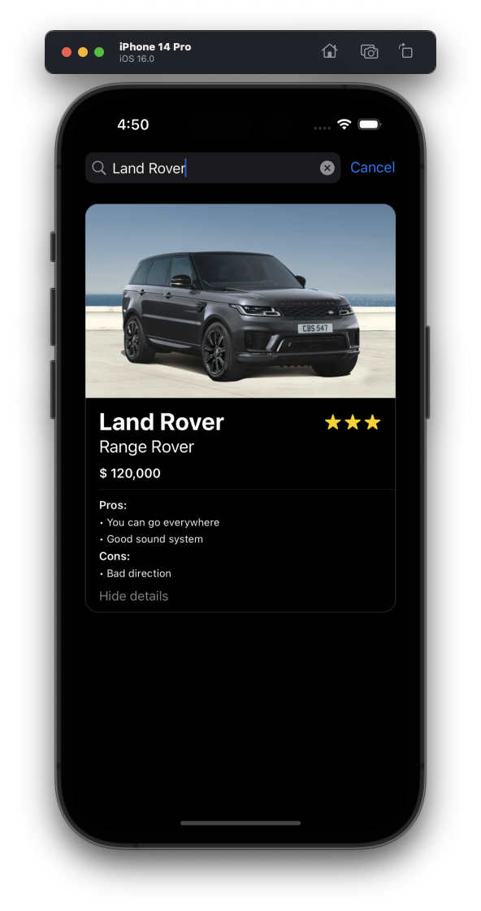

# Car Listing App Challenge
From CWC's September Community Challenge

  
  
  

## Overview

- Develop a working mobile app
- Use a git repo and share it as we want to see your commits
- You can use our prototype as a reference, but feel free to explore and experiment to have a different look and feel for the UI
- The Challenge will comprised of 3 levels: Level 1 (Beginner), Level 2 for (Intermediate), Level 3 (Advanced)
- Please accomplish as many levels as you are comfortable with. You should only proceed to the next level if the current level has already been completely implemented.
- Do not show any part of the UI if it’s not working. Let’s focus on quality over quantity!

## Goals

**Level 1 Requirements:**

- Show a simple list of collapsed items or cards
- Extract the list information from the join JSON file, or you can come up with your own assets
- Show a collapsed list that consists of the following:
  - Car Image
  - Name
  - Price
  - Rating
- Level 1 Reward: Gold Badge

 

**Level 2 Requirements:**

- Add or implement the expandable card to the list
- By default, the first item should be expanded
- Upon clicking or tapping an item, the previous item will collapse, and the new item will expand.
- Pros and cons sections should be shown.
- Note that there is no limit to the number of bullet points inside the card so these should be added and scaled dynamically.
- Level 2 Reward: Platinum Badge

 

**Level 3 Requirements:**

- Implement the filters
- Add a filter section in the UI, such as:
  - Vehicle make
  - Vehicle model
- You can create the two filters list from the JSON provided or come up with your own
- Show the result in the dropdown
- The UI should be updated accordingly upon selecting a specific filter/s
- Level 3 Reward: Diamond Badge

 

Link to the challenge: https://codecrew.codewithchris.com/t/car-listing-app-challenge/19866
